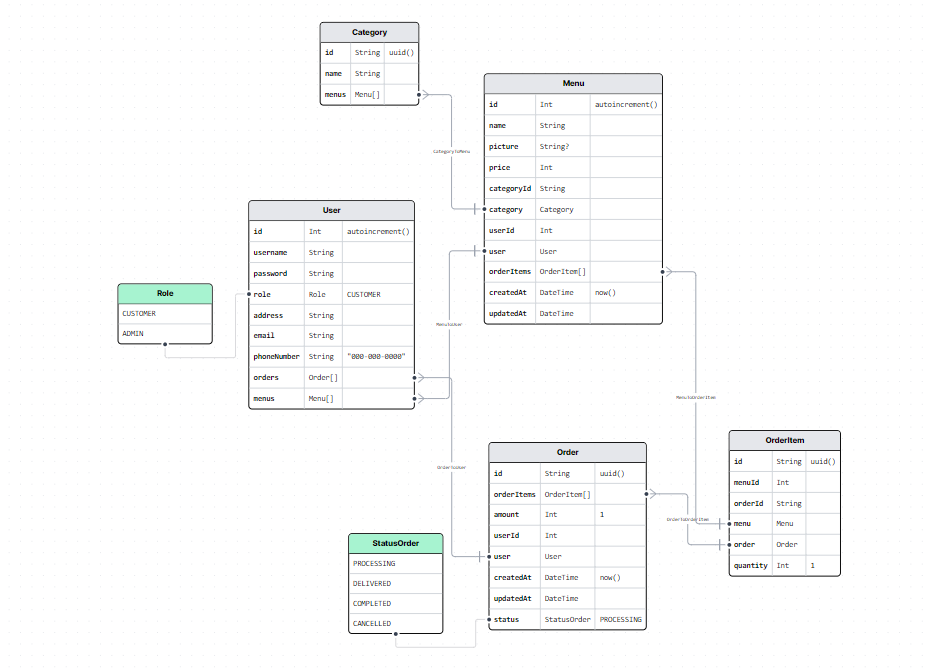
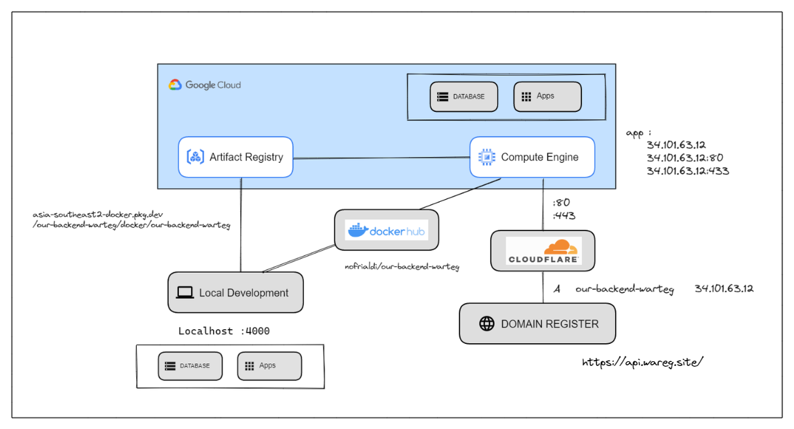

# Website API - Group Project Team E - Wareg

This is our assignment for Week 17 Our Backend

## Table of Content

- [About the Project](#about-the-project)
  - [Team](#Team)
  - [Links](#Links)
  - [Features](#Features)
  - [Api Endpoint](#api-endpoints)
  - [API Documentation](#API-Documentation)
- [Our process](#Our-process)
  - [Database Diagram](#database-diagram)
  - [Architecture Diagram](#architecture-diagram)
  - [Tech Stack](#tech-stack)
  - [What We learned](#what-we-learned)
  - [What to improve](#what-to-improve)
- [Getting Started](#getting-started)
  - [Prerequisites](#prerequisites)
  - [Installation](#installation)
  - [Important Scripts](#important-scripts)
- [Author](#author)

## About the Project


**About 'Wareg': Bringing Convenient, Healthy Meals to Modern Society**  
In today's fast-paced world, finding time for nutritious home-cooked meals can be challenging. "Wareg" is our solution: providing varied, healthy, and easy-to-access meals delivered right to your doorstep. We collaborate with nutritionists, use fresh local ingredients, and offer diverse menus, ensuring your meals are not just food, but a convenient and healthy lifestyle solution. Experience our service and feel the difference.

### Team

| Name         | Role                                 |
| :----------- | :----------------------------------- |
| Okky Anggoro | Lead and Backend Developer           |
| Mesel Ghea   | Backend Developer and Database admin |
| Nofrialdi    | Backend Developer and Infra Engineer |

### Links
 **Live:**


  - <http://api.wareg.site>
  - <https://w17-our-backend-group-e-production-57d7.up.railway.app/>
  - <https://our-backend-warteg.nofri.xyz/>
 

**Docker:**

  - <https://hub.docker.com/r/nofrialdi/our-backend-warteg/tags>
  - <https://asia-southeast2-docker.pkg.dev/our-backend-warteg/docker/our-backend-warteg>

 **Repo :** <https://github.com/revou-fsse-1/w17-our-backend-group-e>

 **Status :** <https://our-backend-group-e.betteruptime.com/>

### API Endpoints

**Authentication**

| **HTTP** | **Endpoint**            | **Description**             |
| :------- | :---------------------- | :-------------------------- |
| `POST`   | `/auth/register`        | register user               |
| `POST`   | `/auth/login`           | login user                  |
| `POST`   | `/auth/forgot-password` | request reset password user |
| `POST`   | `/auth/reset-password`  | reset password user         |

**Users**

| **HTTP** | **Endpoint**  | **Description** | Auth ? | Who can access ? |
| :------- | :------------ | :-------------- | :----- | :--------------- |
| `GET`    | `/users`      | Get all user    | 🔒     | ADMIN            |
| `GET`    | `/users/{id}` | Get user        | 🔒     | ADMIN / CUSTOMER |
| `PATCH`  | `/users/{id}` | Update user     | 🔒     | ADMIN / CUSTOMER |
| `DELETE` | `/users/{id}` | Delete user     | 🔒     | ADMIN            |

**Categories**

| **HTTP** | **Endpoint**         | **Description**    | Auth ? | Who can access ? |
| :------- | :------------------- | :----------------- | :----- | :--------------- |
| `POST`   | `/categories`        | Add Categories     | 🔒     | ADMIN            |
| `GET`    | `/categories/?q=cat` | Get all Categories |        | ADMIN / CUSTOMER |
| `PATCH`  | `/categories/{id}`   | Update Categories  | 🔒     | ADMIN            |

**Menus**

| **HTTP** | **Endpoint**    | **Description** | Auth ? | Who can access ? |
| :------- | :-------------- | :-------------- | :----- | :--------------- |
| `POST`   | `/menus`        | Add Menus       | 🔒     | ADMIN            |
| `GET`    | `/menus/?q=cat` | Get all Menus   |        |                  |
| `PATCH`  | `/menus{id}`    | Update Menus    | 🔒     | ADMIN            |
| `DELETE` | `/menus/{id}`   | Delete Menus    | 🔒     | ADMIN            |

**Orders**

| **HTTP** | **Endpoint**          | **Description**     | Auth ? | Who can access ? |
| :------- | :-------------------- | :------------------ | :----- | :--------------- |
| `POST`   | `/orders`             | Add order           | 🔒     | ADMIN / CUSTOMER |
| `GET`    | `/orders`             | Get all orders      | 🔒     | ADMIN / CUSTOMER |
| `GET`    | `/orders/{id}`        | Get orders          | 🔒     | CUSTOMER         |
| `PATCH`  | `/orders/{id}`        | Update order        | 🔒     | CUSTOMER         |
| `DELETE` | `/orders/{id}`        | Delete order        | 🔒     | CUSTOMER         |
| `PATCH`  | `/orders/{id}/status` | Update order status | 🔒     | ADMIN            |

### API Documentation

**Base API URLs**

- <http://localhost:4000/api>

**Swagger**

- <http://api.wareg.site/api/>
- <https://w17-our-backend-group-e-production-57d7.up.railway.app/api/>

**Postman**
- <https://documenter.getpostman.com/view/21295907/2s93sW7ue1/>


## Our Process

### Database Diagram



In the database, we have the User table storing unique user details, and each user can either be a CUSTOMER or an ADMIN. Users create entries in the Menu table, each linked to a Category and a User. When a User places an Order, it's recorded in the Order table, with its items and their quantities stored in the OrderItem table. The Order table also tracks the status of each order. Thus, the database enables users to create, categorize, and order menu items while tracking order status.

### Architecture Diagram



### Tech Stack

The following technologies were used to build this project:

- **Nestjs**
- **Prisma**
- **Nodemailer**
- **PostgreSQL**
- **Docker**

In addition to these, we also used third-party services to improve the quality of our project:

- **Unsplash**
- **Betteruptime**

### What we learned

- **Understanding data structures and relational models**: In developing an application using a relational database like PostgreSQL, a good understanding of how data is structured and how entities interact with each other is critical.
- **Understanding errors and debugging**: When we receive error messages, it's crucial to read and understand them accurately. Many of the messages contain valuable clues about what needs to be fixed in our code. 
- **Using TypeScript**: TypeScript is a strict programming language that requires you to define data types for variables, parameters, and return values. This helps in writing cleaner and more understandable code, but it also means that we need to carefully plan our data structures.

### What to improve

While our project has been a solid learning exercise and created a functional Web API service, there are always ways to enhance and expand. Here are some areas for improvement:

- **Firebase Integration**: Although we planned to use Firebase for some authentication features, we have not fully implemented it yet. Completing this integration could provide a more seamless and secure authentication experience.
- **Addition of Review/Rating System**: We could enhance our Menu model by introducing a review or ratings system. This could manifest as a new model, Review, encompassing fields like rating, comment, and references to User (who crafted the review) and Menu (which menu is under review). Such a system could offer valuable feedback to both our customers and administrators.
- **Payment Integration**: Another area for possible development would be the integration of payment features into our Order model, with inclusion of aspects like transaction ID, payment method, and payment status. A valuable step forward might also be the integration of a payment gateway. We could utilize third-party services like Stripe or Xendit.
- **Email Notifications**: Leveraging third-party services such as Mailchimp or Mailgun, we could engineer a system to send email notifications to users when their order status changes (e.g., from "PROCESSING" to "DELIVERED"). This enhancement would not only increase user engagement but also offer a superior user experience.
## Getting Started

To get a local copy up and running follow these simple example steps.

### Prerequisites

First, make sure that you have the following installed on your machine:

- Node.js (version 16 or later)

> I recommend you have installed `nvm` in order to set the right node version to run this project
>
> ```sh
> curl -o- https://raw.githubusercontent.com/nvm-sh/nvm/v0.39.2/install.sh | bash
> ```

### Installation

1. Clone the repository to your local machine.
1. Run `pnpm i` in the project directory to install the necessary dependencies.
1. Run `pnpm dev` to start the application in development mode.

### Important Scripts

```sh
git clone https://github.com/revou-fsse-1/w17-our-backend-group-e # Clone the repository
pnpm i # Install all dependencies
pnpm dev # Start the application in development mode
```

## Author

- **Okky Anggoro**
  <a href="https://github.com/anggr" target="blank"></a>
- **Mesel Ghea**
  <a href="https://github.com/meselghea" target="blank"></a>
- **Nofrialdi**
  <a href="https://github.com/nofrialdi" target="blank"></a>
